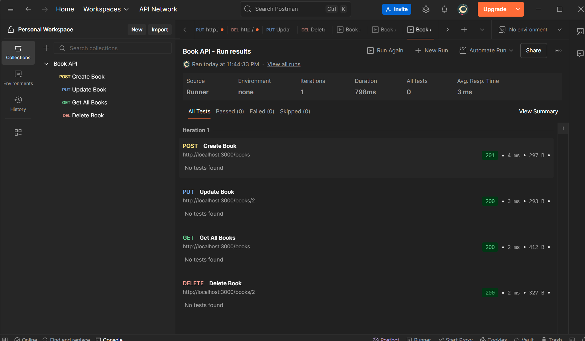
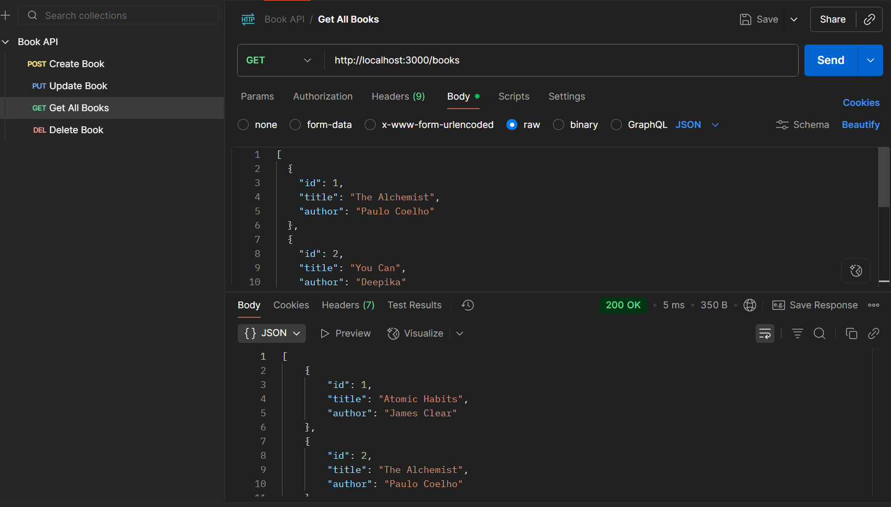
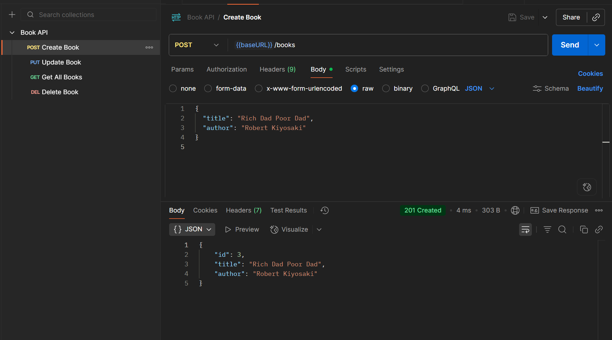
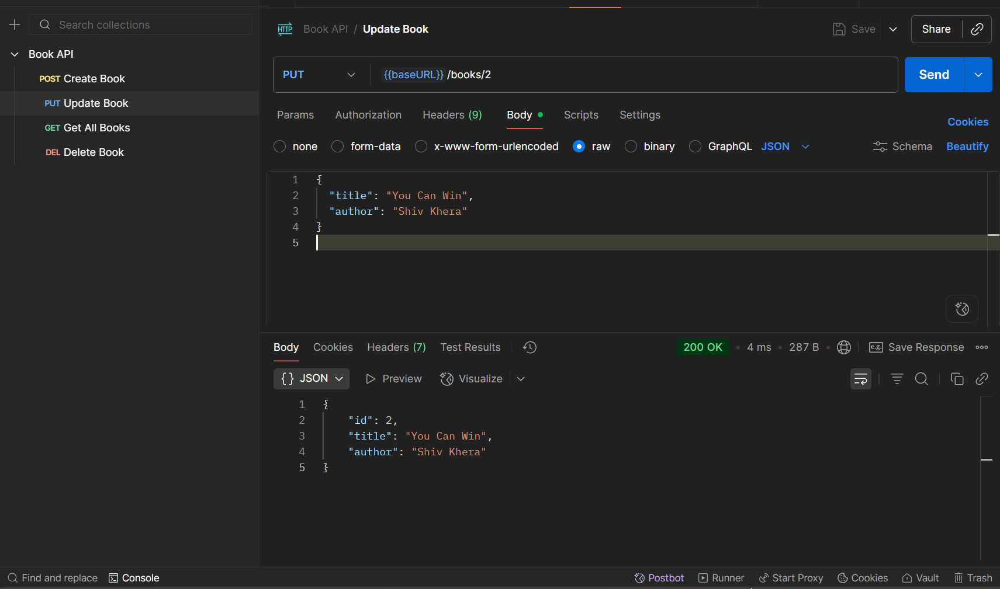
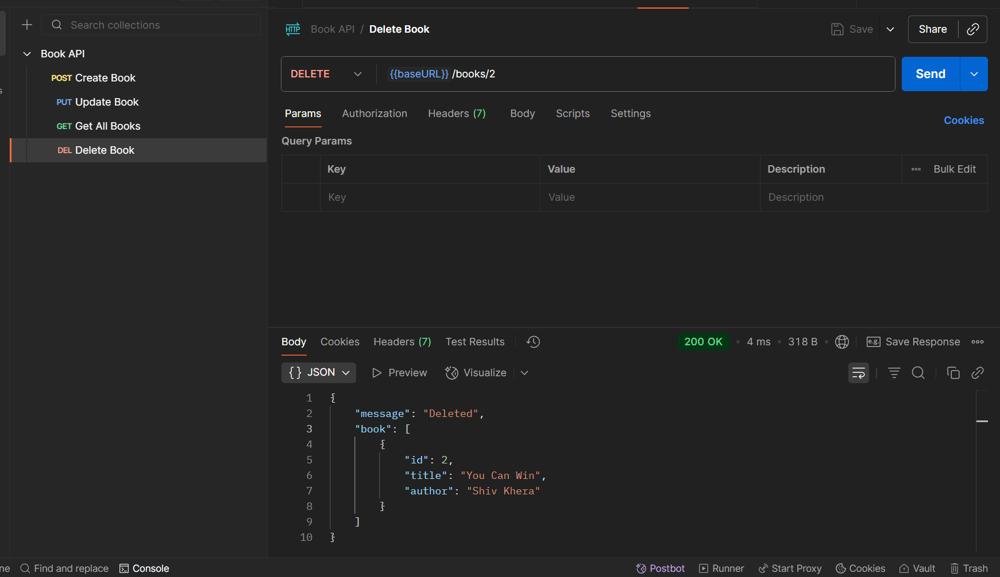

# 📚 Book Manager

A simple **Book Management Application** built with **Node.js, Express, and Vanilla JS**.  
It lets you **Add, View, Update, and Delete books** with a clean UI and REST API support.

---

## 🖼️ Project Preview


---

## ✨ Features
- 📖 Add new books with title & author  
- ✏️ Update existing books  
- ❌ Delete books  
- 🌐 REST API (CRUD operations)  
- 🎨 User-friendly frontend  

---

## 🎬 Demo

### 📸 Frontend UI


### 🔗 API Demo (Postman)

**GET all books**  


**POST a new book**  


**PUT update book**  


**DELETE book**  


---

## 📘 Example API Response
```json
[
  { "id": 1, "title": "The Alchemist", "author": "Paulo Coelho" },
  { "id": 2, "title": "You Can", "author": "Deepika" },
  { "id": 3, "title": "Alice in Wonderland", "author": "Lewis Carroll" },
  { "id": 4, "title": "Vampire Diaries", "author": "L. J. Smith" }
]
